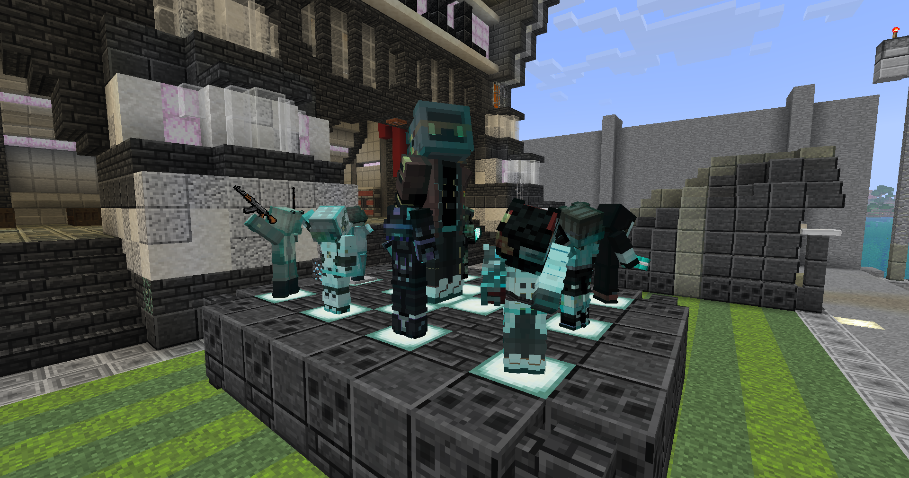

# Player Armor Stands Lite
Name an armor stand and have it displayed as a player model!

## Features
- Fetch skins from Mojang, NameMC, or local files.
- Capes are also supported
- Overlay your player models with block textures, with custom blend %.
- Configure: slim/wide arms, capes, block texture overlays

## Usage
Rename an armor stand in an anvil to a player name or click the "Skin Configurator" button when an armor stand is placed in an anvil.

## Commands
- ``/pas reload all`` - Reloads all active skins.
- ``/pas reload failed`` - Retries skins that failed to download.
- ``/pas reload cape <name>`` - Force refreshes a specific cape.
- ``/pas reload skin <name>`` - Force refreshes a specific player skin.
- ``/pas debug drop_cache`` - Clears the memory and texture cache.

## Disclaimer
This mod is a fork/substantial revision of [Danrus' Player Armor Stands mod](https://modrinth.com/mod/player-armor-stands). All credit to [Danrus110_](https://modrinth.com/user/Danrus110_) for creating the original version of the mod and the logic which this mod is based on. This mod complies with the conditions of the MIT License that PAS is licensed under. I started working on this because many players on my server use this mod and complain about the original PAS being buggy/laggy. I have decided to publish this as a separate mod rather than contributing upstream because the revisions to the code are so substantial as to warrant another mod.

This mod aims to achieve feature parity with the armor stand configuration options included in the original PAS mod. Every named armor stand should render equivalently using this mod as well, i.e. the mod should parse the PAS name format the same way and render the same skin/overlay.

Changes include:
- Simplifications in the code for many of the mod's systems. The original PAS code had many abstractions that made it (IMO) difficult to read and work with. This version collapses many of those into less classes and less code, and signifigantly changes the structure of the code.
- No more legacy version support, only the latest version of Minecraft (26.2) is supported.
- No more NeoForge support, only Fabric is supported.
- Does not include the compatibility patches the original PAS had for some other mods (may be added later)
- Memes/Easter Eggs from the original version are no longer supported.
- Improved performance due to restructured code that caches more efficiently, has less indirection, has no I/O or heavy filesystem syscalls on the render thread (all/most heavy network and file I/O is async), and parses more efficiently (the armor stand name parser in previous versions of PAS contributed to much of the frame drops).
- Improve robustness in terms of fetching skins/skin data, with back-off retry and fail-fast for un-retryable responses

## Dependencies:
- Fabric
- YACL

Qwen was heavily utilized in the creation of this mod and the revising of the original Player Armor Stands mod.
